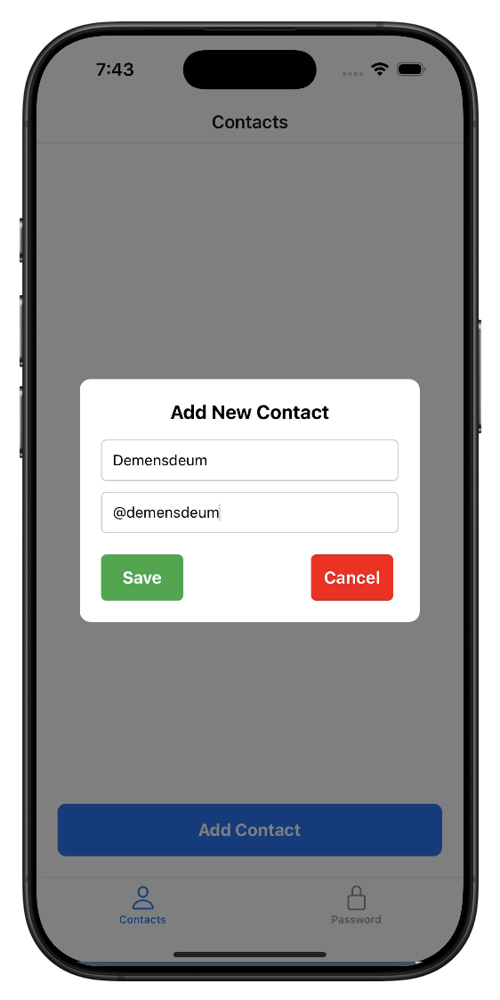

# Ghost Contacts

Ghost Contacts is a React Native application that allows you to manage a secret contact list. The app ensures privacy by keeping your contacts hidden from the default contact list.

**⚠️ Disclaimer:** This app is just a toy! If someone has access to your device, this app will not protect your contacts from being discovered. Use it at your own discretion.

## 📱 Preview

### Add New Contact


### Contacts List


## 🚀 Features

- 📂 Secret contact list management
- 🌙 Minimalist UI/UX
- 🔧 Built with React Native & Expo

## 🔧 Installation

To run Ghost Contacts locally, follow these steps:

1. Clone the repository:
   ```sh
   git clone https://github.com/demensdeum/GhostContacts
   cd GhostContacts
   ```

2. Install dependencies:
   ```sh
   npm install
   ```
   or
   ```sh
   yarn install
   ```

3. Start the app:
   ```sh
   expo start
   ```

## 📦 Technologies Used

- [React Native](https://reactnative.dev/)
- [Expo](https://expo.dev/)

## 🔗 Online Application

You can access the online version of the app here:  
[Ghost Contacts – Online](https://demensdeum.com/software/ghost-contacts/)

## 🔗 Expo Snack

You can try the app on Expo Snack:
[Ghost Contacts on Snack](https://snack.expo.dev/@demensdeum/ghost-contacts)

## 📜 License

MIT License © 2025 Ilia Prokhorov
