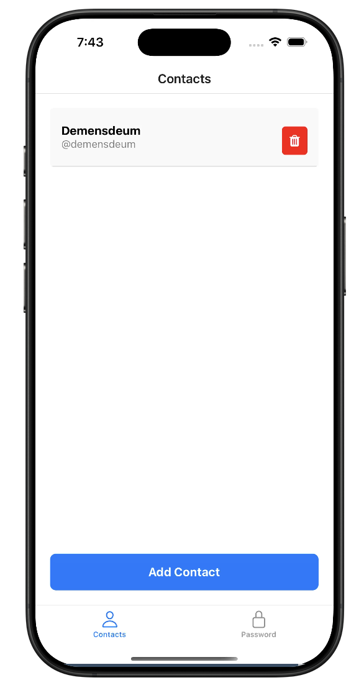

# Ghost Contacts

Ghost Contacts is a React Native application that allows you to manage a secret contact list. The app ensures privacy by keeping your contacts hidden from the default contact list.

## 📱 Preview

### Home Screen


### Contact Details


## 🚀 Features

- 📂 Secret contact list management
- 🔒 Secure and private storage
- 🌙 Minimalist UI/UX
- 🔧 Built with React Native & Expo

## 🔧 Installation

To run Ghost Contacts locally, follow these steps:

1. Clone the repository:
   ```sh
   git clone https://github.com/demensdeum/ghost-contacts.git
   cd ghost-contacts
   ```

2. Install dependencies:
   ```sh
   npm install
   ```
   or
   ```sh
   yarn install
   ```

3. Start the app:
   ```sh
   expo start
   ```

## 📦 Technologies Used

- [React Native](https://reactnative.dev/)
- [Expo](https://expo.dev/)

## 🔗 Demo

You can try the app on Expo Snack:
[Ghost Contacts on Snack](https://snack.expo.dev/@demensdeum/ghost-contacts)

## 📜 License

MIT License © 2025 Ilia Prokhorov
